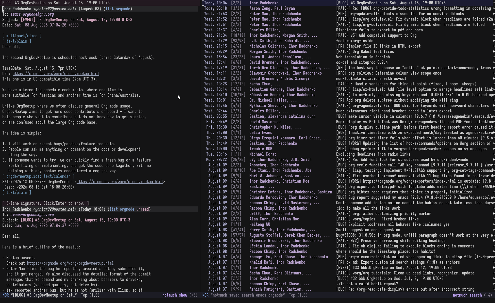
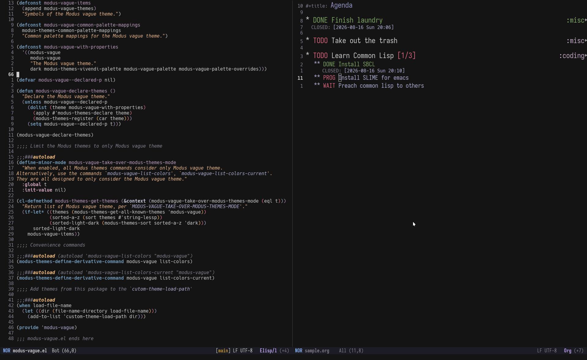

#+title: Modus Vague theme for GNU Emacs
#+author: Ashish Panigrahi
#+startup: showeverything

This is the emacs port of the [[https://github.com/vague-theme/vague][vague]] theme built on top of [[https://protesilaos.com/emacs/modus-themes][Modus
themes]].

As described in the primary vague theme repo:

#+begin_quote
A cool, dark, low contrast colorscheme. Pastel yet vivid, like a
fleeting memory...
#+end_quote

*Note:*

modus-vague is a work-in-progress. Since it builds up on Modus themes,
most of the font-faces should work. If not, please open an issue on
the issue tracker.

* Screenshots

*Notmuch*

Two windows side by side, showing the org-mode mailing list in a
=notmuch-search-mode= buffer and another window showing a message in
a =notmuch-show-mode= buffer.

*Org-mode* and *Elisp*

Two windows showing an =org-mode= buffer and an =emacs-lisp-mode= buffer.

* Installation

** With =use-package=

#+begin_src emacs-lisp
  (use-package modus-vague
    :vc (:url "https://github.com/paniash/modus-vague"
         :rev :newest
         :branch "main")
    :config
    (modus-themes-load-theme 'modus-vague))
#+end_src

** Manual Installation

- Clone the git repository into a directory (say =~/.emacs.d/themes/=):

#+begin_src shell
  git clone https://github.com/paniash/modus-vague ~/.emacs.d/themes/modus-vague
#+end_src

- Add the following to your =init.el=:

#+begin_src emacs-lisp
  (add-to-list 'custom-theme-load-path "~/.emacs.d/themes/modus-vague")
  (load-theme 'modus-vague t)
#+end_src

Since this theme builds on top of modus themes, one can use the same customization options that modus themes provide.

* Contributing

Contributions are always welcome! Please specify if you've used LLMs
and to which degree, as depending on the usage the PR can be rejected.
Any issues or PRs submitted should be the author's responsibility and
not purely vibecoded without understanding the code.
