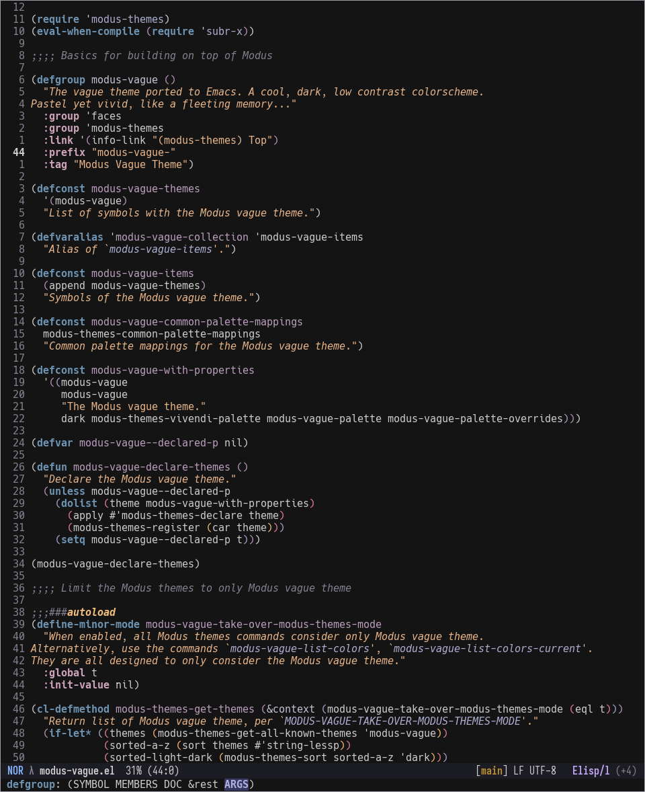
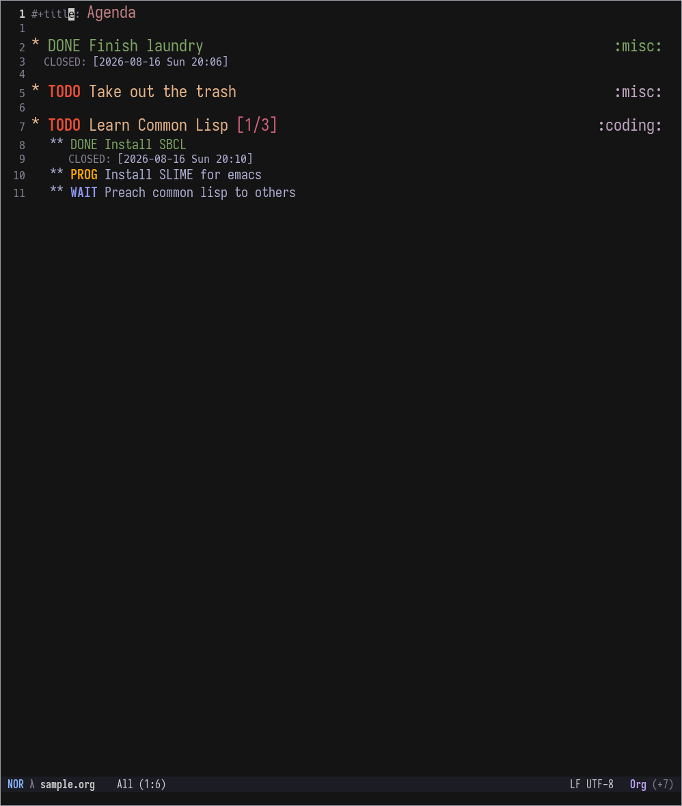
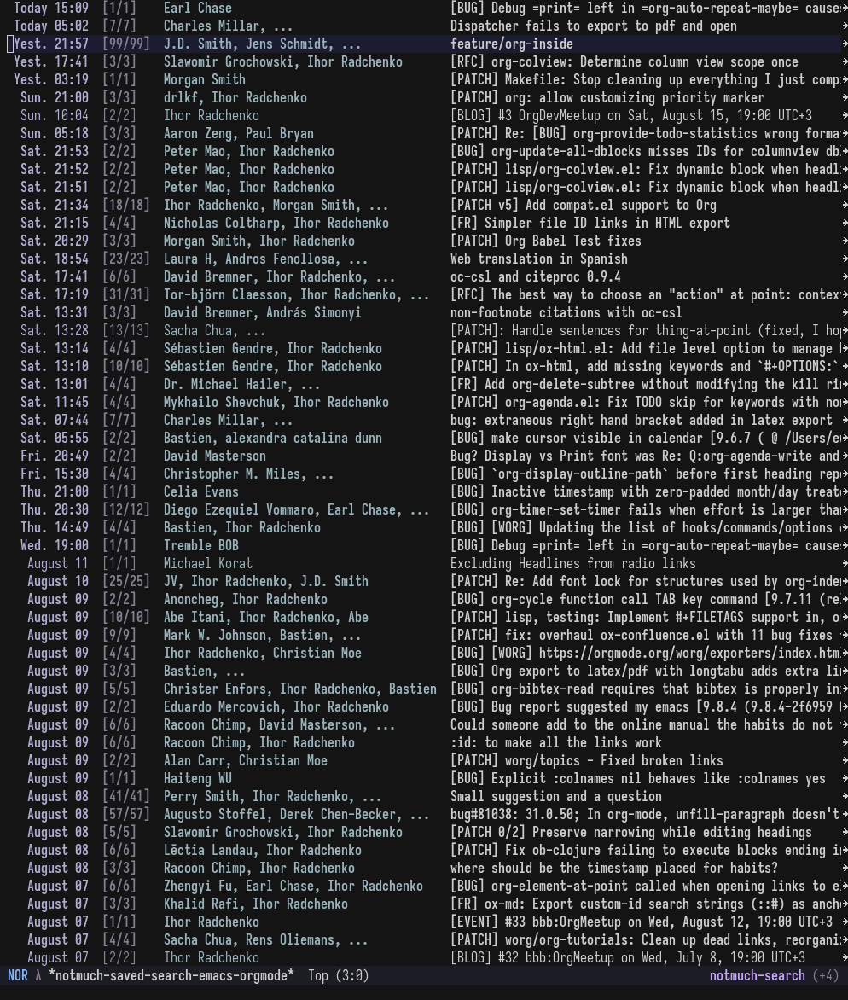

#+title: Modus Vague theme for GNU Emacs
#+author: Ashish Panigrahi
#+startup: showeverything

This is the emacs port of the [[https://github.com/vague-theme/vague][vague]] theme built on top of [[https://protesilaos.com/emacs/modus-themes][Modus
themes]].

As described in the primary vague theme repo:

#+begin_quote
A cool, dark, low contrast colorscheme. Pastel yet vivid, like a
fleeting memory...
#+end_quote

*Note:*

I ported this theme for emacs for personal use. As such, the current
state of the theme serves most of my needs.

Since it builds up on Modus themes, most of the font-faces should
work. If not, please open an issue on the issue tracker.

* Screenshots

*Elisp*

*Org-mode*

*Notmuch*

* Installation

** With =use-package= and =package.el=

#+begin_src emacs-lisp
  (use-package modus-vague
    :vc (:url "https://github.com/paniash/modus-vague"
         :rev :newest
         :branch "main")
    :config
    (modus-themes-load-theme 'modus-vague))
#+end_src

** With =use-package= and =straight.el=

#+begin_src emacs-lisp
  (use-package modus-vague
    :straight (modus-vague :host github
                           :repo "paniash/modus-vague"
                           :branch "main")
    :config
    (modus-themes-load-theme 'modus-vague))
#+end_src

** Manual Installation

- Clone the git repository into a directory (say =~/.emacs.d/themes/=):

#+begin_src shell
  git clone https://github.com/paniash/modus-vague ~/.emacs.d/themes/modus-vague
#+end_src

- Add the following to your =init.el=:

#+begin_src emacs-lisp
  (add-to-list 'custom-theme-load-path "~/.emacs.d/themes/modus-vague")
  (load-theme 'modus-vague t)
#+end_src

Since this theme builds on top of modus themes, one can use the same customization options that modus themes provide.

* Contributing

Contributions are always welcome! No LLM-generated code was used in
this package, hence only open PRs with code that was not generated by LLMs.

Please open issues you might face, in the [[https://github.com/paniash/modus-vague/issues][issue tracker]].

* License

GNU General Public License v3.0. See [[./COPYING][COPYING]] for details.

* Acknowledgements

Modus vague was written by [[https://ashishpanigrahi.com][Ashish Panigrahi]].

This package is possible, thanks to the contribution of [[https://protesilaos.com][Protesilaos]]
and his hardwork on [[https://protesilaos.com/emacs/modus-themes][Modus themes]]. Thanks to the folks who've developed
the [[https://github.com/vague-theme/vague][Vague palette]] for an excellent theme!
